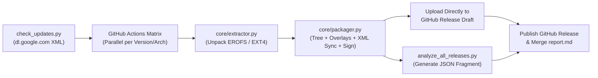

# Pure Google GApps Builder & Automated Release Pipeline

**PureGoogleGappsBuilder** is an automated, zero-modification Google Apps (GApps) extraction, packaging, and verification pipeline. It extracts **100% genuine Google APKs, native libraries, frameworks, and configurations** directly from Google's official Android SDK System Images (`dl.google.com`) and packages them into **MindTheGapps-compatible**, recovery-flashable ZIP archives for **Android 9.0.0 through Android 15.0.0** (`arm64`, `x86`, `x86_64`).

---

## ✨ Key Features

- **100% Genuine Google Binaries**: Connects directly to Google's official SDK repositories (`sys-img2-3.xml`) to fetch unmodified `GmsCore`, `Phonesky`, `GoogleServicesFramework`, `Velvet`, `SetupWizard`, and native JNI libraries (`lib64`/`lib`).
- **100% MindTheGapps Structural Parity**:
  - Uses official `MindTheGapps/vendor_gapps` file trees across branches `pie` (9.0), `q` (10.0), `r` (11.0), `s` (12.0), `sigma` (12.1), `tau` (13.0), `upsilon` (14.0), and `vic` (15.0).
  - Generates standard `META-INF/com/google/android/update-binary`, `addon.d/30-gapps.sh` OTA survival scripts, and static `toybox` utilities (`toybox-arm`, `toybox-x86`).
- **Automated RRO Overlay Compilation**: Compiles runtime resource overlays (`GmsOverlay.apk`, `GmsSettingsProviderOverlay.apk`, `GmsSettingsOverlay.apk`, `GmsSetupWizardOverlay.apk`) on the fly using `aapt` + `apksigner` with automatic `android.jar` (`SDK <= 34` classic `resources.arsc`) resolution.
- **Bootloop-Proof Privileged Permission Sync (`ro.control_privapp_permissions=enforce`)**:
  - Parses every APK placed in `priv-app/` (`system`, `product`, `system_ext`) via `androguard`.
  - Filters requested permissions strictly to `signature|privileged` (`protectionLevel & 0x10` + APK-declared custom privileged permissions) and deduplicates across existing partition XMLs (`privapp-permissions-google*.xml`) so devices never bootloop on missing privileged permissions.
- **Recovery-Standard Whole-File OTA Signing**: Signs flashable ZIPs with AOSP testkeys using `--v1-signer-name CERT` (`META-INF/CERT.RSA`, `META-INF/CERT.SF`, `META-INF/MANIFEST.MF`, and `META-INF/com/android/otacert`) matching `signapk.jar`.
- **Deep Release Verification & Diff Analyzer (`analyzer/`)**:
  - Compares every built package against `MindTheGapps` in parallel during CI matrix runs.
  - Performs byte-level and semantic XML `<privapp-permissions>` diffing plus full APK `versionName` / `versionCode` / size inspection via HTTP Range requests (without downloading multi-hundred-MB ZIPs when running remotely).

---

## 📱 Supported Android Versions & Architectures

| Android Version | API Level | Upstream Branch | Supported Architectures |
| :--- | :---: | :---: | :--- |
| **Android 9.0.0** (Pie) | `28` | `pie` | `arm64`, `x86` |
| **Android 10.0.0** (Q) | `29` | `q` | `arm64`, `x86` |
| **Android 11.0.0** (R) | `30` | `r` | `arm64`, `x86` |
| **Android 12.0.0** (S) | `31` | `s` | `arm64`, `x86`, `x86_64` |
| **Android 12.1.0** (S_V2) | `32` | `sigma` | `arm64`, `x86_64` |
| **Android 13.0.0** (Tiramisu) | `33` | `tau` | `arm64`, `x86`, `x86_64` |
| **Android 14.0.0** (UpsideDownCake) | `34` | `upsilon` | `arm64`, `x86_64` |
| **Android 15.0.0** (VanillaIceCream) | `35` | `vic` | `arm64`, `x86_64` |

---

## 🏗️ Project Architecture

```text
PureGoogleGappsBuilder/
├── check_updates.py              # Scans dl.google.com sys-img2-3.xml & builds CI matrix
├── extract_pure_gapps.py         # Main CLI entry point to build a single GApps ZIP
├── analyze_all_releases.py       # CLI entry point for single-target & full release analysis
├── core/
│   ├── downloader.py             # Multi-retry streaming downloader with progress verification
│   ├── extractor.py              # Unpacks Super/GPT, EROFS (fsck.erofs), and EXT4 (7z) images
│   └── packager.py               # Structures GApps tree, compiles overlays, syncs XMLs & signs ZIP
├── analyzer/
│   ├── zip_inspector.py          # Local & HTTP Range remote ZIP central directory reader
│   ├── xml_analyzer.py           # Semantic <privapp-permissions> & <config> XML parser & differ
│   ├── apk_analyzer.py           # APK AndroidManifest binary XML versionName/versionCode extractor
│   └── report_generator.py       # Generates per-matrix JSON fragments & Markdown comparison reports
└── .github/workflows/
    └── pure_google_gapps.yml     # Automated daily & manual GitHub Actions CI/CD pipeline
```

---

## ⚙️ How the Pipeline Works



1. **Direct Google Repository Discovery (`check_updates.py`)**:
   - Queries Google's official system image manifests (`google_apis_playstore/sys-img2-3.xml`, `google_apis/sys-img2-3.xml`).
   - Compares SHA-1 checksums and revisions against `state/google_release_state.json` to trigger builds only when Google publishes new images (or on manual `workflow_dispatch`).
2. **Partition Unpacking (`core/extractor.py`)**:
   - Downloads the official system image archive and unpacks nested `system.img`, `product.img`, and `system_ext.img` partitions supporting raw EXT4, EROFS (`fsck.erofs`), and dynamic `super` / GPT partition tables.
3. **Smart Packaging & Permission Enforcement (`core/packager.py`)**:
   - Fetches the baseline file list and static configs from `MindTheGapps/vendor_gapps` for the target branch.
   - Replaces aging static APKs with fresh genuine Google APKs from the unpacked official SDK image where compatible (verifying native shared library architecture and 64-bit requirements).
   - Compiles RRO overlay APKs (`GmsOverlay`, `GmsSettingsProviderOverlay`, etc.) and signs them with AOSP testkeys.
   - Scans every `priv-app` APK's `AndroidManifest.xml` and injects any missing `signature|privileged` permissions into the partition's `privapp-permissions-google*.xml`.
   - Signs the final flashable archive with `apksigner` (`CERT.RSA`/`CERT.SF`) and embeds `META-INF/com/android/otacert`.
4. **Zero-Bloat CI/CD & Automated Verification (`.github/workflows/pure_google_gapps.yml`)**:
   - Each matrix worker uploads its multi-hundred-MB `.zip` **directly to the GitHub Release**, avoiding multi-gigabyte temporary workflow artifacts.
   - Simultaneously, each matrix worker runs `analyze_all_releases.py --mode single` against the locally built `.zip` and the corresponding remote `MindTheGapps` release, saving a tiny (`~10 KB`) JSON fragment.
   - The `publish-release` job merges all JSON fragments into a comprehensive `report.md` artifact containing file-tree comparisons, XML semantic diffs, and APK version tables.

---

## 🚀 Usage

### 1. Prerequisites

Install required system tools and Python packages (Ubuntu/Debian):

```bash
sudo apt-get update
sudo apt-get install -y p7zip-full erofs-utils aapt apksigner openjdk-17-jre-headless git curl
pip install androguard requests
```

### 2. Check for Official Google Updates

Scan Google's official repositories and view available system images:

```bash
python3 check_updates.py --force-all
```

### 3. Build a Flashable GApps Package Locally

Run `extract_pure_gapps.py` with the target Android version, architecture, ABI, and official `dl.google.com` system image URL:

```bash
python3 extract_pure_gapps.py \
  --android "14.0.0" \
  --arch "x86_64" \
  --abi "x86_64" \
  --url "https://dl.google.com/android/repository/sys-img/google_apis_playstore/x86_64-34_r14.zip" \
  --out-dir "out"
```

The signed recovery-flashable package will be generated at:
```text
out/GoogleGapps-14.0.0-x86_64.zip
```

### 4. Run the Release Verification & Diff Analyzer

Compare a locally built ZIP against the official `MindTheGapps` release (generates a JSON fragment):

```bash
python3 analyze_all_releases.py \
  --mode single \
  --local-zip "out/GoogleGapps-14.0.0-x86_64.zip" \
  --version "14.0.0" \
  --arch "x86_64" \
  --fragment-out "fragment-14.0.0-x86_64.json"
```

Merge multiple matrix JSON fragments into a single Markdown report (`report.md`):

```bash
python3 analyze_all_releases.py \
  --mode merge \
  --fragments-dir "./fragments" \
  --report-out "report.md"
```

Or run a full live comparison across all published GitHub releases of both repositories (using HTTP Range requests without downloading full archives):

```bash
python3 analyze_all_releases.py --mode all --report-out "report.md"
```

---

## 🛡️ Technical Safeguards Against Bootloops

1. **Strict `protectionLevel & 0x10` Permission Filtering**:
   Android enforces `ro.control_privapp_permissions=enforce`, which refuses to boot if a privileged app requests a `signature|privileged` permission missing from `/etc/permissions/privapp-permissions-*.xml`. Conversely, dumping normal (`0x0`) or runtime (`0x1`) permissions bloats XMLs by 10x. `core/packager.py` cross-references `android.jar`, a curated AOSP privileged permissions registry, and custom APK `<permission>` declarations to inject **only** true privileged permissions.
2. **Cross-XML Deduplication**:
   On Android 10+, permissions are split across base (`privapp-permissions-google.xml`) and partition-specific (`privapp-permissions-google-product.xml`, `privapp-permissions-google-system-ext.xml`) files. `sync_privapp_permissions()` reads all XMLs in a partition before writing to guarantee zero duplicate entries.
3. **64-Bit Only Compliance on Android 15 (`vic`)**:
   Automatically strips obsolete 32-bit `lib/libjni_latinimegoogle.so` on 64-bit-only Android 15 targets while preserving `lib64/libjni_latinimegoogle.so` and adding `FamilyLinkParentalControls.apk` and `sysconfig_contextual_search.xml` in alignment with upstream `MindTheGapps`.
